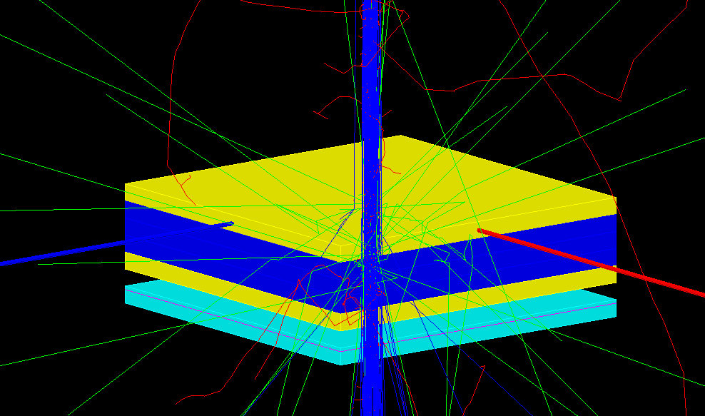

# Simulation of the proton beam tracker/calorimeter
> This project will have tools to aid a simulation and optimizatin of the proton beam tracker/calorimeter in application for determining the corrections to the proton stopping powers for treatment planning.




## Prerequisites

To use this package you need to first install:
* [root](https://root.cern/install/) 
* [Gate](http://www.opengatecollaboration.org)
    * I am using a version of Gate I cloned from [their Github](https://github.com/OpenGATE/Gate) page, because the official 9.0 verion has a bug.
* [Geant4](https://geant4.web.cern.ch/support/download)
    * Check the requirements for the correct verion of Geant4 on [OpenGate](http://www.opengatecollaboration.org) page
* [Cmake](https://cmake.org/download/)

## Install

**Not working yet**

~~`pip install gate_simulation`~~

## How to use

Initiate a macro writer:

```python
test_macro = MacroWriter()
```

## The error on the mean versus sensor thickness
Sensor material is silicon.
The mean is the trimmed mean the upper limit is twice the standard deviation from the untrimmed mean.

```python
import numpy as np
tm = []
etm = []
thicknesses = np.linspace(0.02, 1.0)
for t in thicknesses:
    main_macro, output_root = create_all(sensor_thickness=t)
    run_macro(main_macro)
    root_hits_file = output_root['hits'][0]
    edep = get_edep_data(root_hits_file)
    # check that edep exists
    if edep.any():
        tm.append(stats.tmean(edep, limits=(edep.min(),np.mean(edep) + 2 * np.std(edep))))
        etm.append(stats.tsem(edep, limits=(edep.min(),np.mean(edep) + 2 * np.std(edep))))
    else:
        print(f'No result for point {t}')
        # print(f'Trimmed mean {round(tm, 2)}, Error on trimmed mean: {round(etm, 2)}, SNR: {round(tm/etm, 2)}')
```


    ---------------------------------------------------------------------------

    NameError                                 Traceback (most recent call last)

    <ipython-input-5-2a7ddd594455> in <module>
          1 tm = []
          2 etm = []
    ----> 3 thicknesses = np.linspace(0.02, 1.0)
          4 for t in thicknesses:
          5     main_macro, output_root = create_all(sensor_thickness=t)


    NameError: name 'np' is not defined


5 phatom layers each 1 cm thick, the two outer layers had skull as their material, the 3 inner ones had water as the material. The beam was 250 MeV proton pencil beam. The sensor thickness was varied between 20 and 1000 $\mu$m

```python
import matplotlib.pyplot as plt
plt.scatter(thicknesses, np.array(tm)/np.array(etm))
```

---

### Save the data to and read them back from csv

Next two cells show some practice with saving and reading back csv files.

```python
import csv
columns = ["thickness", "trimmed mean", "error_on_trimmed_mean"]
with open('thickness.csv', 'w', encoding='utf-8') as f_out:
    f_writer = csv.writer(f_out, delimiter=',', lineterminator='\n')
    f_writer.writerow(columns)
    f_writer.writerows(zip(thicknesses, tm, etm))
```

```python
import pandas
thickness_df = pandas.read_csv('thickness.csv')
# thickness_df.head()
plt.scatter(thickness_df['thickness'], thickness_df['trimmed mean']/thickness_df['error_on_trimmed_mean'])
```

---

Study of the trimmed mean. I have checked that the error on the trimmed mean is larger than the error arising from uncertainty on the upper trim value. The upper trim value of 2 standard deviation from the untrimmed mean seems to give a reasonable result.

```python
import numpy as np
from scipy import stats

m = np.mean(edep)
em = stats.sem(edep)
tm = stats.tmean(edep, limits=(edep.min(),np.mean(edep) + 2 * np.std(edep)))
tm_p = stats.tmean(edep, limits=(edep.min(),np.mean(edep) + 2 * np.std(edep) + em))
tm_m = stats.tmean(edep, limits=(edep.min(),np.mean(edep) + 2 * np.std(edep) - em))
etm = stats.tsem(edep, limits=(edep.min(),np.mean(edep) + 2 * np.std(edep)))
print(f'Mean:        {round(m,2)},       Error on mean: {round(em,2)}, SNR: {round(m/em, 2)}')
print(f'Trimmed mean {round(tm, 2)}, Error on trimmed mean: {round(etm, 2)}, SNR: {round(tm/etm, 2)}')
print(f'Trimmed mean upper {round(tm_p, 2)}, Trimmed mean lower {round(tm_m, 2)} difference: {round(tm_p - tm_m, 2)}, SNR: {round(tm/(tm_p - tm_m), 2)}')

#print(stats.mode(np.round(edep, 0)))
```

---

## Kinetic energy from momentum

Recalculating the kinetic energy $E_k$ of the  particle mass  $M$ from its momentum $p$  according to:

$$E_k = \sqrt{M^2  + p^2} - M$$


```python
print(f'The kinetic energy of 2 GeV/c proton is {Ek(938,2000):.0f} MeV')
```

## Export notebooks
