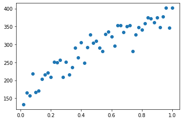

# Simulation of the proton beam tracker/calorimeter
> This project will have tools to aid a simulation and optimizatin of the proton beam tracker/calorimeter in application for determining the corrections to the proton stopping powers for treatment planning.


## Prerequisites

To use this package you need to first install:
* [root](https://root.cern/install/) 
* [Gate](http://www.opengatecollaboration.org)
    * I am using a version of Gate I cloned from [their Github](https://github.com/OpenGATE/Gate) page, because the official 9.0 verion has a bug.
* [Geant4](https://geant4.web.cern.ch/support/download)
    * Check the requirements for the correct verion of Geant4 on [OpenGate](http://www.opengatecollaboration.org) page
* [Cmake](https://cmake.org/download/)

## Install

**Not working yet**

~~`pip install gate_simulation`~~

## How to use

Initiate a macro writer:

```python
test_macro = MacroWriter()
```

Create a macro:

```python
def create_all(n_phantom_layers = 5, phantom_layer_thickness = 1, phantom_material = 'Water', 
               distance_to_system = 1, system_thickness = 1, n_sensors = 1, sensor_pitch = 0.5, sensor_thickness=0.5):
    """sets parameters for phantom and system geometries"""
    phantom_thickness = n_phantom_layers * phantom_layer_thickness
    system_thickness = (sensor_thickness + sensor_pitch) * n_sensors
    # initialize an instance of MacroWriter
    my_macro = MacroWriter(system_y_loc=(-1)*phantom_thickness - distance_to_system, 
                           system_thickness=system_thickness)
    # create phantom layers
    for layer in range(n_phantom_layers):
        phantom_material = 'Water'
        # set material to Skull for the first and the last layer
        if layer == 0 or layer == n_phantom_layers - 1: 
            phantom_material = 'Skull'
        # layers start from 0 and extend in the negative y direction
        y_loc = (-1) * (phantom_layer_thickness * layer)
        my_macro.create_phantom_layer(n=layer, thickness=phantom_layer_thickness, y_loc=y_loc,
                                     material=phantom_material)
    for i_sensor in range(n_sensors):
        my_macro.create_sensor(n=i_sensor, y_loc= -(sensor_pitch + sensor_thickness) * i_sensor, 
                               thickness=sensor_thickness)
    return my_macro.create_macro_file()
```

```python
main_macro, output_root = create_all(n_sensors=3)
```

    system thickness: 3.0
    y location of sensor 0 is: 1.25
    system created with: thickness: 3.0 at loc: -6
    system thickness: 3.0
    y location of sensor 1 is: 0.25
    system thickness: 3.0
    y location of sensor 2 is: -0.75


```python
run_macro(main_macro)
```

## The error on the mean versus sensor thickness
Sensor material is silicon.
The mean is the trimmed mean the upper limit is twice the standard deviation from the untrimmed mean.

```python
tm = []
etm = []
thicknesses = np.linspace(0.02, 1.0)
for t in thicknesses:
    main_macro, output_root = create_all(sensor_thickness=t)
    run_macro(main_macro)
    root_hits_file = output_root['hits'][0]
    edep = get_edep_data(root_hits_file)
    # check that edep exists
    if edep.any():
        tm.append(stats.tmean(edep, limits=(edep.min(),np.mean(edep) + 2 * np.std(edep))))
        etm.append(stats.tsem(edep, limits=(edep.min(),np.mean(edep) + 2 * np.std(edep))))
    else:
        print(f'No result for point {t}')
        # print(f'Trimmed mean {round(tm, 2)}, Error on trimmed mean: {round(etm, 2)}, SNR: {round(tm/etm, 2)}')
```

```python
import matplotlib.pyplot as plt
plt.scatter(thicknesses, np.array(tm)/np.array(etm))
```


    <matplotlib.collections.PathCollection at 0x7fa2b2110ac0>





```python
import csv
columns = ["thickness", "trimmed mean", "error_on_trimmed_mean"]
with open('thickness.csv', 'w', encoding='utf-8') as f_out:
    f_writer = csv.writer(f_out, delimiter=',', lineterminator='\n')
    f_writer.writerow(columns)
    f_writer.writerows(zip(thicknesses, tm, etm))
```

```python
import pandas
thickness_df = pandas.read_csv('thickness.csv')
# thickness_df.head()
plt.scatter(thickness_df['thickness'], thickness_df['trimmed mean']/thickness_df['error_on_trimmed_mean'])
```


    <matplotlib.collections.PathCollection at 0x7fa2963e2f40>


```python
import numpy as np
from scipy import stats

m = np.mean(edep)
em = stats.sem(edep)
tm = stats.tmean(edep, limits=(edep.min(),np.mean(edep) + 2 * np.std(edep)))
tm_p = stats.tmean(edep, limits=(edep.min(),np.mean(edep) + 2 * np.std(edep) + em))
tm_m = stats.tmean(edep, limits=(edep.min(),np.mean(edep) + 2 * np.std(edep) - em))
etm = stats.tsem(edep, limits=(edep.min(),np.mean(edep) + 2 * np.std(edep)))
print(f'Mean:        {round(m,2)},       Error on mean: {round(em,2)}, SNR: {round(m/em, 2)}')
print(f'Trimmed mean {round(tm, 2)}, Error on trimmed mean: {round(etm, 2)}, SNR: {round(tm/etm, 2)}')
print(f'Trimmed mean upper {round(tm_p, 2)}, Trimmed mean lower {round(tm_m, 2)} difference: {round(tm_p - tm_m, 2)}, SNR: {round(tm/(tm_p - tm_m), 2)}')

#print(stats.mode(np.round(edep, 0)))
```

    Mean:        181.66000366210938,       Error on mean: 2.4, SNR: 75.55
    Trimmed mean 161.17, Error on trimmed mean: 0.66, SNR: 242.78
    Trimmed mean upper 161.22, Trimmed mean lower 161.17 difference: 0.05, SNR: 3146.49


Recalculating the kinetic energy $E_k$ of the  particle mass  $M$ from its momentum $p$  according to:

$$E_k = \sqrt{M^2  + p^2} - M$$


```python
print(f'The kinetic energy of 2 GeV/c proton is {Ek(938,2000):.0f} MeV')
```

    The kinetic energy of 2 GeV/c proton is 1271 MeV


```python
!ls mac
```

    my_proton_beam.mac sensor1.mac        visu.mac
    sensor0.mac        sensor2.mac

